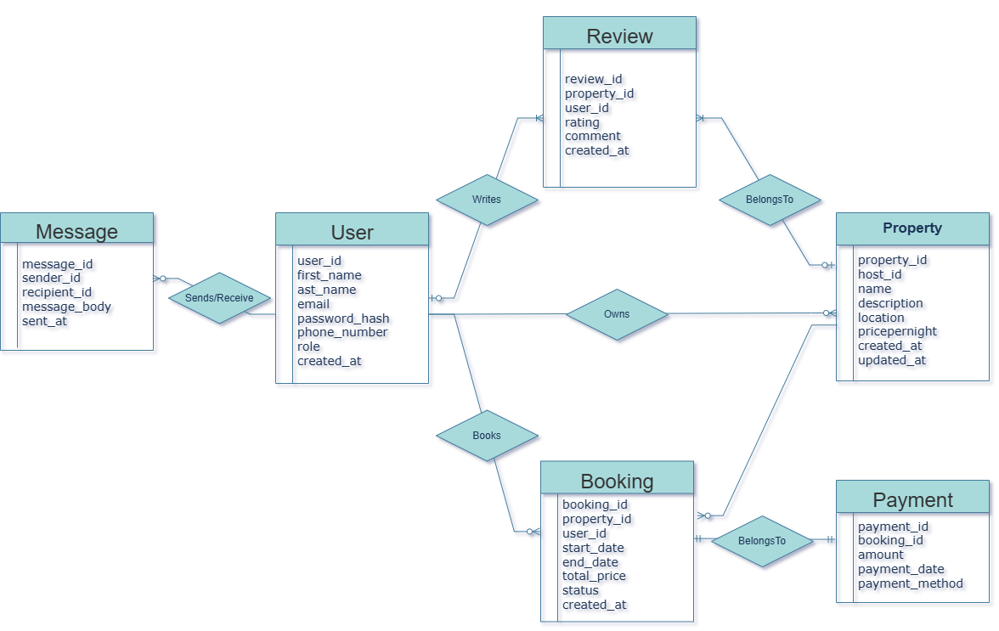

# Entity Relationship Diagrams (ERD)
# Requirements
# 1. **Entities**: Identify the main entities in your system. These could be things like Users, Products, Orders, etc.
# 2. **Attributes**: For each entity, list the attributes that you need to store. For example, a User entity might have attributes like UserID, Name, Email, etc.
# 3. **Relationships**: Define how the entities are related to each other. This could be one-to-one, one-to-many, or many-to-many relationships.
# 4. **Cardinality**: Specify the cardinality of each relationship. This indicates how many instances of one entity can be associated with instances of another entity.

# ER Diagram of the AirBnb System
# 