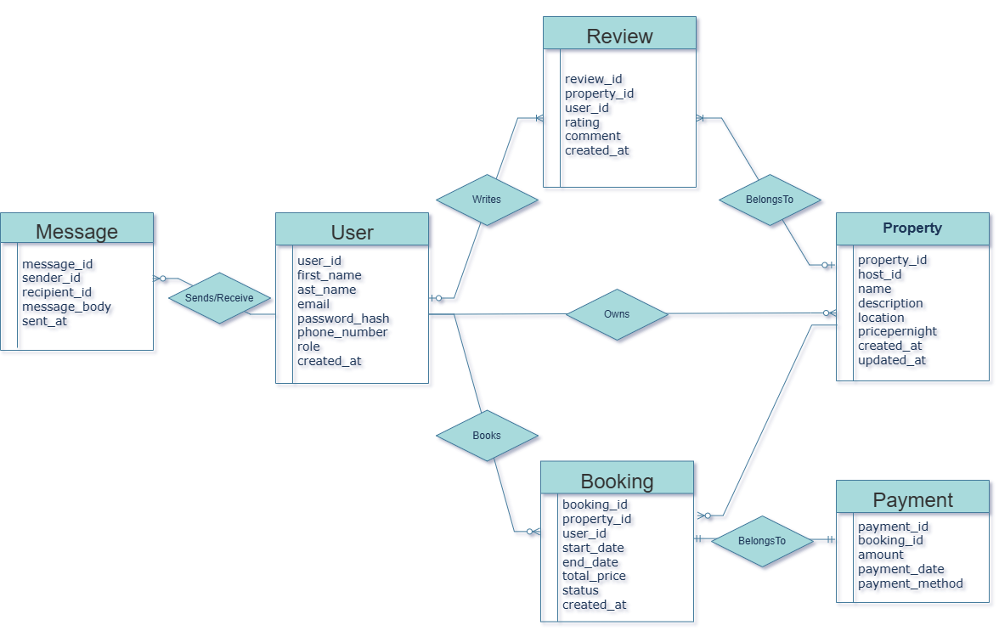

Entity Realationship Diagram
========================
This is a simple Entity Relationship Diagram (ERD) for the database schema used in this project. The diagram illustrates the relationships between different entities in the database.

# After Normalization (Its already in 3NF)

# Database Schema

