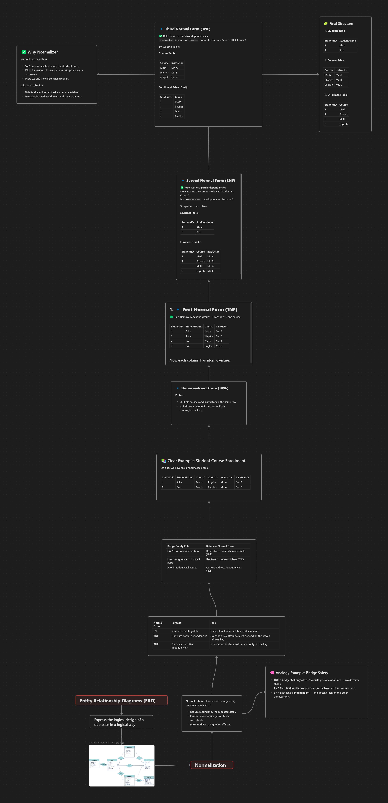

# Normalization

✅ 1. User  
**Schema:**
```sql
user_id (PK), first_name, last_name, email, password_hash, phone_number, role, created_at
```
✔️ **Normal Form:** 3NF  
✅ **Why:**
- All columns are atomic → ✔ 1NF  
- No partial dependencies (no composite PK) → ✔ 2NF  
- No transitive dependencies (e.g., email doesn't determine role or password_hash) → ✔ 3NF  

💡 **Notes:**  
- `email` is UNIQUE – good for login.  
- `role` as an ENUM is fine; if roles grow more complex, consider a separate Role table.

---

✅ 2. Property  
**Schema:**
```sql
property_id (PK), host_id (FK), name, description, location, pricepernight, created_at, updated_at
```
✔️ **Normal Form:** 3NF  
✅ **Why:**
- All columns are atomic → ✔ 1NF  
- No composite PK → ✔ 2NF  
- No transitive dependencies → ✔ 3NF  

💡 **Notes:**  
- `host_id` is a FK to `User(user_id)` — nicely normalized.  
- If `location` becomes structured (city, country, ZIP), consider separating it.

---

✅ 3. Booking  
**Schema:**
```sql
booking_id (PK), property_id (FK), user_id (FK), start_date, end_date, total_price, status, created_at
```
✔️ **Normal Form:** 3NF  
✅ **Why:**
- No multivalued fields or arrays → ✔ 1NF  
- All non-key attributes depend fully on PK → ✔ 2NF  
- No transitive dependencies (e.g., `status` is intrinsic to the booking) → ✔ 3NF  

💡 **Notes:**  
- `total_price` is sometimes considered derivable (price per night × nights), but storing it is valid for auditing and pricing history.

---

✅ 4. Payment  
**Schema:**
```sql
payment_id (PK), booking_id (FK), amount, payment_date, payment_method
```
✔️ **Normal Form:** 3NF  
✅ **Why:**
- Atomic → ✔ 1NF  
- Fully dependent on `payment_id` → ✔ 2NF  
- No transitives → ✔ 3NF  

💡 **Notes:**  
- `payment_method` as ENUM is fine; could be a table if extended in the future.

---

✅ 5. Review  
**Schema:**
```sql
review_id (PK), property_id (FK), user_id (FK), rating, comment, created_at
```
✔️ **Normal Form:** 3NF  
✅ **Why:**
- No arrays or repeating values → ✔ 1NF  
- Fully dependent on PK → ✔ 2NF  
- No indirect dependencies → ✔ 3NF  

💡 **Notes:**  
- Consider adding uniqueness constraint: `(user_id, property_id)` to ensure one review per user per property.

---

✅ 6. Message  
**Schema:**
```sql
message_id (PK), sender_id (FK), recipient_id (FK), message_body, sent_at
```
✔️ **Normal Form:** 3NF  
✅ **Why:**
- No multivalued or nested data → ✔ 1NF  
- All fields directly depend on `message_id` → ✔ 2NF  
- No derived or indirect dependencies → ✔ 3NF  

💡 **Notes:**  
- This is a clean message table. If threads/conversations are needed later, consider a `thread_id`.

---

## for more details
# 
